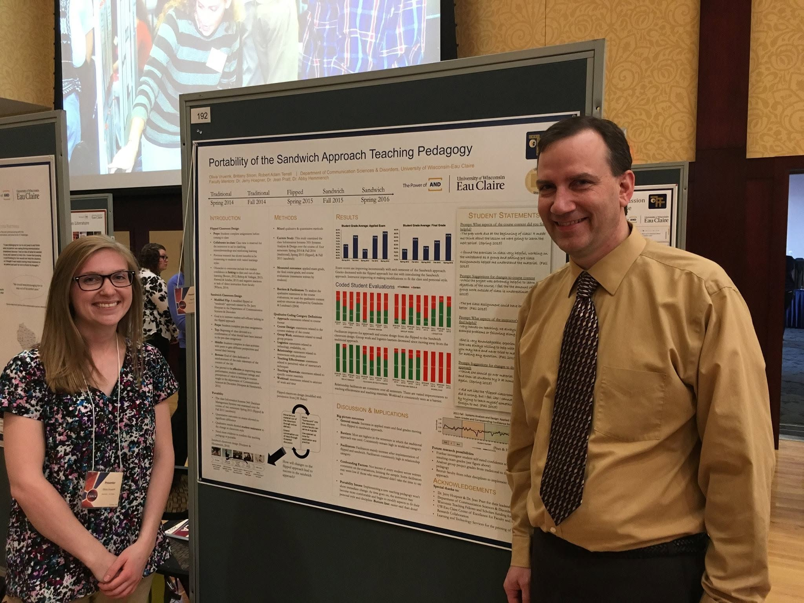
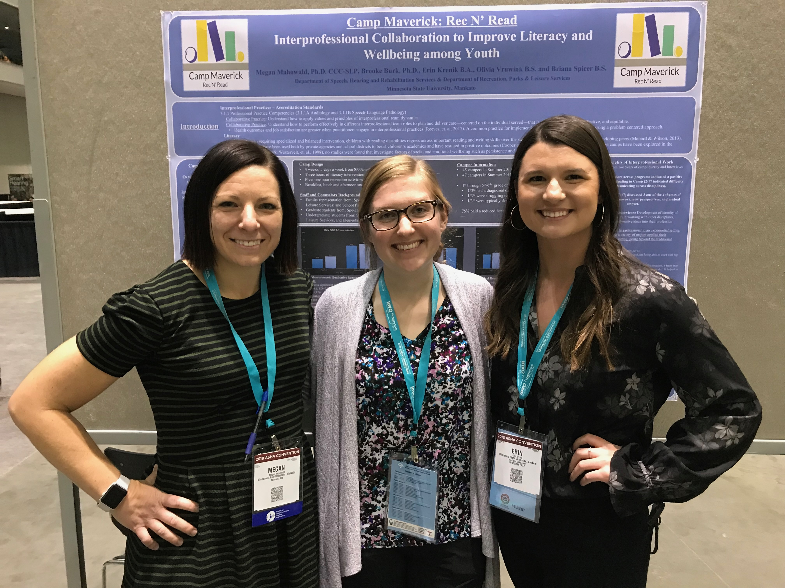
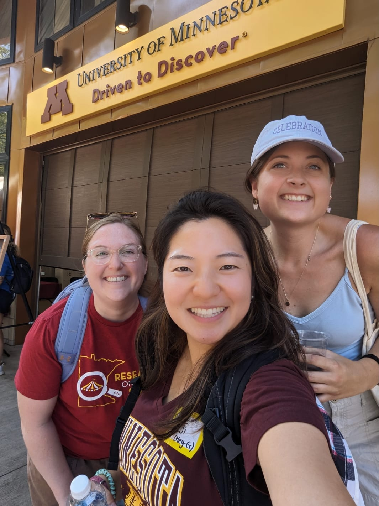
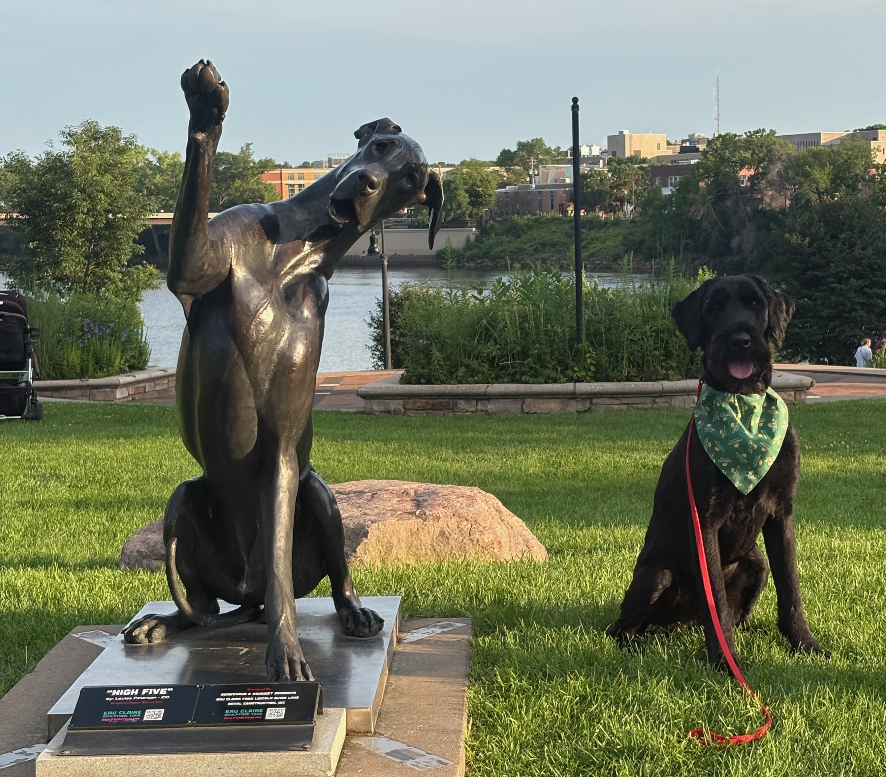
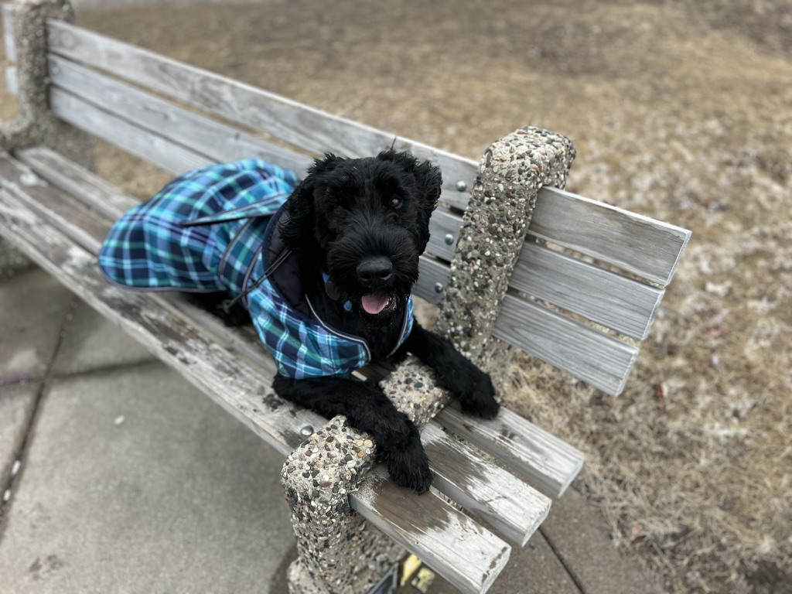
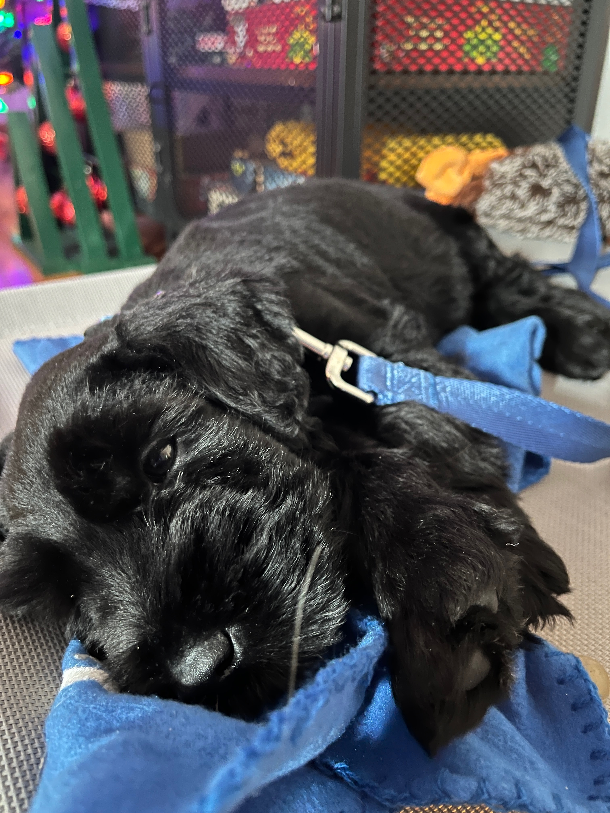

###  Academic & Clinical Journey
My interest in research began as an undergraduate at the University of Wisconsin-Eau Claire. Within the Scholarship of Teaching and Learning (SoTL) Lab and under the mentorship of Dr. Jerry Hoepner, I qualitatively analyzed the acceptability of a modified flipped classroom teaching pedagogy. During my master's program at Minnesota State University, Mankato I researched the impact of interprofessional education within a recreation/literacy camp with Dr. Megan Mahowald.

I then worked clinically as an SLP in the public schools for three years, working with students ranging from preschool through age 21. Managing a diverse caseload strengthened my skills in clinical reasoning and interdisciplinary collaboration, and also illuminated how research is applied in real-world settings. 

These experiences deepened my interest in conducting clinically meaningful research and ultimately led me to pursue doctoral training at the University of Minnesota in Dr. Natalie Covington's Trajectories after Brain Injury (TABI) Lab, where my work focuses on psychosocial well-being and rehabilitation after traumatic brain injury, particularly among individuals with TBI and their care partners.

::: {.photo-gallery layout-ncol=2}

{fig-alt="Olivia presenting undergraduate research at CERCA"}

{fig-alt="Olivia presenting Rec N Read research at ASHA 2018"}

{fig-alt="Olivia with Mary Radomski and Natalie Covington at the ICCDC conference"}

{fig-alt="Olivia and two cohort members at the Minnesota State Fair"}

:::

###  Outside of Work

I grew up in Wisconsin—Go Pack Go! I like to read, listen to podcasts, and [puzzle](https://myspeedpuzzling.com/en/player-profile/0193cd4b-faa8-7252-aff3-96fdfc47cf9c). I recently took a beginner crochet class and am hooked! My favorite TV show is *Survivor*, I can always discuss best/worst contestants and seasons.

My partner Matt and I enjoy playing cribbage, listening to live music, and going on walks with our dog Blu (short for Blugold, a nod to where we met at UW–Eau Claire), a 3.5-year-old Giant Schnauzer.

::: {.photo-gallery layout-ncol=2}

{fig-alt="Blu sitting beside a dog statue at Phoenix Park"}

{fig-alt="A younger Blu lying on a park bench"}

{fig-alt="Blu posing with the UW–Eau Claire Blugold mascot"}

{fig-alt="Blu sleeping as a puppy"}

:::
